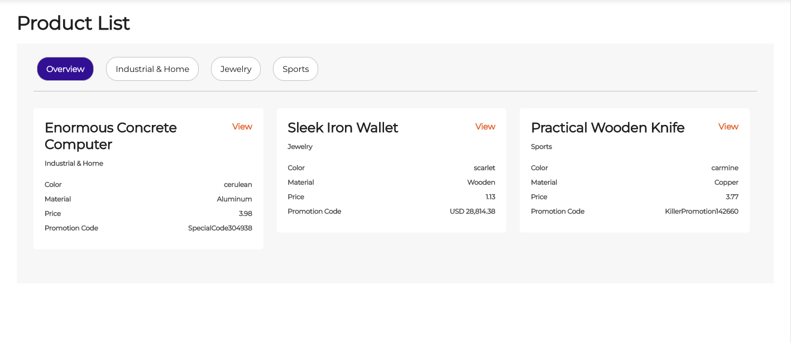

# Choco Up coding test (Frontend developer)

## Background
This is a test aims to test different area of your knowledge and skill.  Please fork or download the codebase to start your development.

## Requirement 
You are required to build a simlpe application with the following UI
- Fetch a minimum of 20 records from the API and display the data as the UI
- Show `Overview` and all department data as a rounded button, clicking buttons will only show related department, while `Overview` will reset the display to all departments
- The `View` link/button does not require any action, the font color is `rgb(229, 104, 36)`
- The standard font size will be 12px
- You are not needed to follow all exact font size and margin/padding size
- Your app should be ready for production and can be run or deploy easily
- A README or documentation describing if you have to make any technicial decision, i.e any tools or frameworks or libraries to use

### UI sample:


### Data
We will use Random Data API to get the list of data to display

Documentation: https://random-data-api.com/documentation

API endpoint: https://random-data-api.com/api/commerce/random_commerce

### Data sample:

```json
[
    {
        "id": 4768,
        "uid": "43af5392-9d49-4daa-a00c-7addb60f972d",
        "color": "cerulean",
        "department": "Industrial \u0026 Home",
        "material": "Aluminum",
        "product_name": "Enormous Concrete Computer",
        "price": 1.32,
        "price_string": "3.98",
        "promo_code": "SpecialCode304938"
    },
    {
        "id": 4103,
        "uid": "a8ebf345-965c-40fa-9aea-dea971a188d3",
        "color": "scarlet",
        "department": "Jewelry",
        "material": "Wooden",
        "product_name": "Sleek Iron Wallet",
        "price": 96.47,
        "price_string": "1.13",
        "promo_code": "SweetDiscount494205"
    },
    {
        "id": 9451,
        "uid": "75b29c5e-3e73-443b-8ae9-314a4ca566ba",
        "color": "carmine",
        "department": "Sports",
        "material": "Copper",
        "product_name": "Practical Wooden Knife",
        "price": 96.67,
        "price_string": "3.77",
        "promo_code": "KillerPromotion142660"
    }
]
```

## Note


## Bonus
Depends on your capability, you can choose to add any of the following feature as extra, or any other reasonable add-ons.
- Use Typescript on the development
- Show more data by:
  - pagination
  - load more button at the bottom
  - scroll to the bottom
- Responsive
- Any transition or loading effect 


